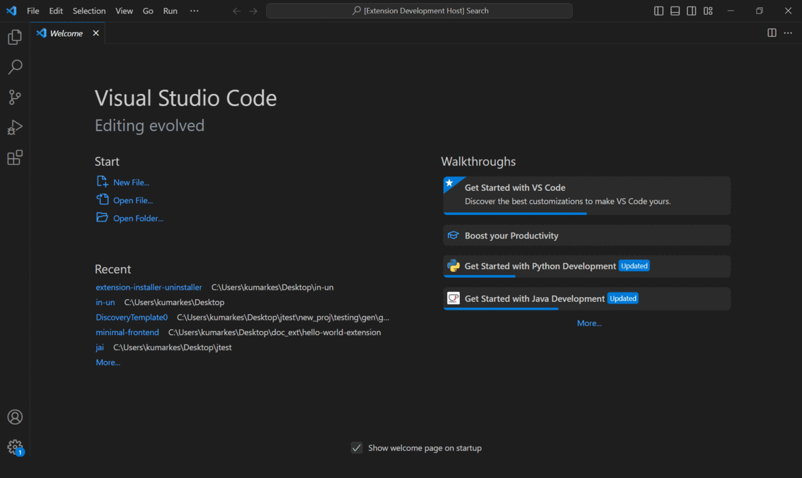
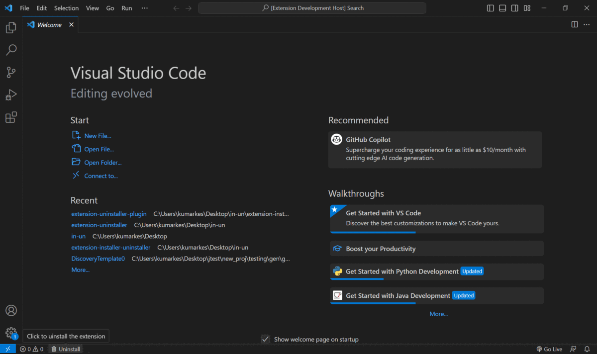
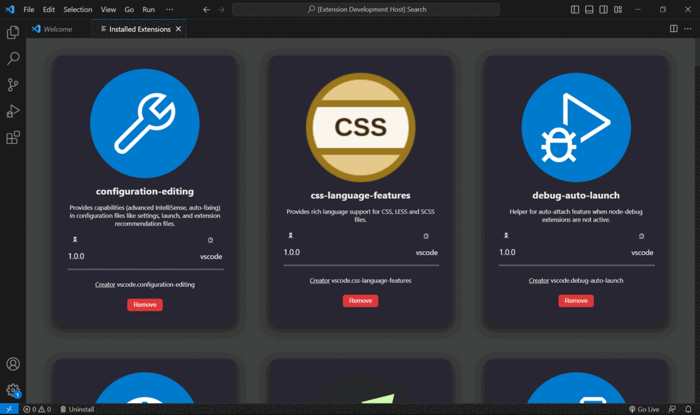

# Extension Uninstaller

This is a Visual Studio Code extension that allows you to view and uninstall installed extensions from within the editor. It provides a webview panel that displays a list of installed extensions along with their details.

# Features

* View the list of installed extensions with their names, versions, descriptions, and publisher information.

* See an icon representing each installed extension (if available).

* Uninstall extensions directly from the webview panel or using the status bar button or by the use of keybinding.

# Requirements

This extension requires Visual Studio Code version 1.60.0 or higher.

# Installation

* Launch Visual Studio Code.

* Go to the Extensions view by clicking on the Extensions icon in the Activity Bar on the side of the window.

* Search for `Extension Uninstaller` in the Extensions view search bar.

* Click on the `Install` button next to the extension name to install it.

# Usage
## Uninstalling Extensions
### Using the Webview Panel
* Open the Command Palette by pressing `Ctrl+Shift+P` (Windows/Linux) or `Cmd+Shift+P` (macOS).

* Search for `Extension : uninstaller` and select it.

* A webview panel will open displaying the list of installed extensions.

* To remove an extension, click the `Remove` button next to the extension's name.

* A confirmation message will pop up asking if you want to uninstall the extension. Click `Yes` to proceed with the uninstallation or `No` to cancel.

### Using the Status Bar Button

* After installing the extension, you will see a status bar item with the text "$(trash) Uninstall".

* Click on the status bar item to trigger the uninstallation process.

* A webview panel will open, displaying the list of installed extensions.

* Follow the same steps as mentioned above to remove an extension.

### Using the Keybindings
The following keybindings are available for the "Extension Uninstaller" command:

* Windows/Linux: `Ctrl+u`
* macOS: `Cmd+u` 

To uninstall extensions using the keybindings, follow these steps:

* Open Visual Studio Code.

* Ensure that the "Extension Uninstaller" extension is installed. If not, refer to the "Installation" section in the README to install the extension.

* Make sure the focus is on the editor (text editor) area where you are working on your code.

* Press the appropriate keybinding for your operating system:
   - On Windows and Linux, press `Ctrl+U`.
   - On macOS, press `Cmd+U`.

* A webview panel will open, displaying the list of installed extensions.

6. To remove an extension, locate the extension you want to uninstall in the list, and click the `Remove` button next to its name.

7. A confirmation message will pop up asking if you want to uninstall the extension. Click `Yes` to proceed with the uninstallation or `No` to cancel.

# Known Issues

* If an extension does not have an icon specified, it will not be displayed in the webview.

* Uninstalling an extension will permanently remove it from your system. Be cautious when using this feature.

# Feedback and Contributions

If you encounter any issues or have suggestions for improvement, please [open an issue](https://github.com/Priyanshukeshri/extension-uninstaller-plugin/issues) on the GitHub repository.

Pull requests are also welcome! If you want to contribute to the development of this extension.

**Enjoy!**
